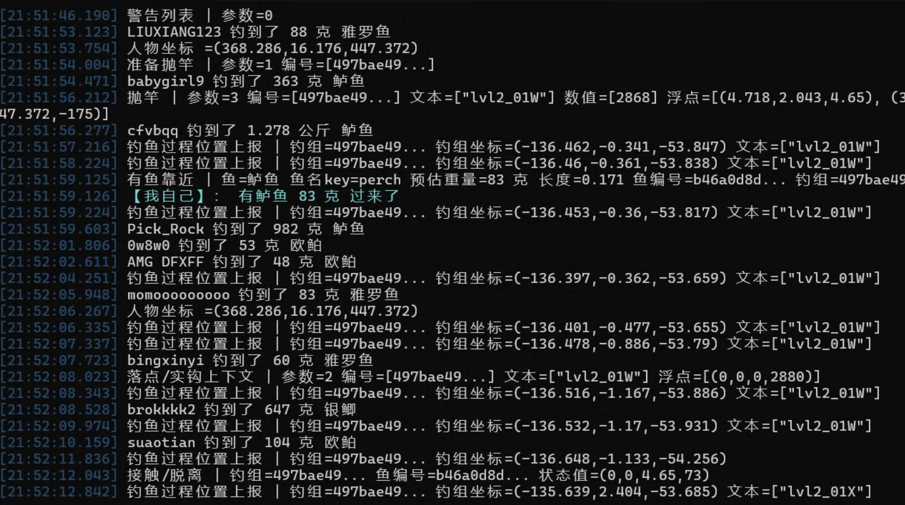

# RF4 Monitor

RF4 Monitor 是一个 `俄罗斯钓鱼4`游戏的网络流量监控工具，用于本地代理 RF4 的登录 HTTPS 和 realtime TCP 流量，解析游戏业务数据，并在控制台输出更易读的中文信息。

为了不破坏游戏实际体验，本工具仅实现了提前“窥探”当前服务端下发的鱼的信息功能。

## 主要功能

- 自动接管 `api.rf4game.ru` 登录域名
- 自动解析登录包中的 realtime 服务器地址和端口
- 自动把登录返回的 realtime 地址改写到本地监听端口
- 继续代理真实 realtime TCP 业务流量
- 解析 RF4 应用层协议数据
- 输出频道鱼获信息
- 输出自己来鱼、入护提示
- 输出人物坐标、钓组坐标、搏鱼状态、公共聊天等监控信息

## 目录文件

```text
rf4_monitor/
  rf4_monitor.py        主程序
  rf4_monitor.bat       Windows 启动脚本
  安装依赖.bat          Python 依赖安装脚本，使用清华源
  requirements.txt      Python 依赖列表
  fish_labels_zh.json   鱼名中文映射
  reference_defaults.txt 默认网络参考配置
  rf4_hosts.txt         hosts 示例
  screenshot/           截图目录
  certs/                证书目录
  归档.zip              当前目录打包文件
```

证书文件：

```text
certs/rf4_monitor.crt
certs/rf4_monitor.key
certs/rf4_monitor.pem
```

## 安装

### 1. 安装 Python 3

安装 Python 3.9 或更高版本。Windows 安装时建议勾选：

```text
Add Python to PATH
```

安装完成后，打开 `cmd` 检查：

```bat
py -3 --version
pip3 --version
```

如果命令不存在，重新安装 Python，并确认已勾选 `Add Python to PATH`。

### 2. 安装 Python 依赖

进入工具目录：

```bat
cd /d tools\rf4_monitor
```

双击运行：

```text
安装依赖.bat
```

也可以手动执行：

```bat
pip3 install -r requirements.txt -i https://pypi.tuna.tsinghua.edu.cn/simple --trusted-host pypi.tuna.tsinghua.edu.cn
```

当前依赖主要是：

```text
mitmproxy>=9,<10
```

### 3. 导入自签证书

RF4 登录 HTTPS 流量需要本地证书。证书文件位于：

```text
certs\rf4_monitor.crt
```

如果 `certs\rf4_monitor.crt` 不存在，先运行一次：

```bat
rf4_monitor.bat --prepare-only
```

导入方式一：图形界面导入

1. 双击 `certs\rf4_monitor.crt`
2. 点击 `安装证书`
3. 选择 `本地计算机`
4. 选择 `将所有的证书都放入下列存储`
5. 选择 `受信任的根证书颁发机构`
6. 完成导入

导入方式二：管理员命令导入

```bat
certutil -addstore Root certs\rf4_monitor.crt
```

证书导入后，再以管理员身份运行 `rf4_monitor.bat`。

## 启动

1. 关闭 RF4
2. 右键以管理员身份运行 `rf4_monitor.bat`
3. 等待控制台出现监听信息
4. 启动 RF4 并登录游戏
5. 在控制台查看解析结果

管理员权限通常是必须的，因为程序需要：

- 修改 Windows hosts
- 监听 `443` 和 realtime 业务端口

## 默认行为

正常启动时不需要额外参数。程序会自动完成：

- 扫描参考流量，提取 RF4 域名和 realtime 地址
- 使用 `reference_defaults.txt` 作为兜底网络配置
- 更新 Windows hosts
- 准备本地证书
- 启动 mitmdump
- 监听登录 HTTPS 端口
- 监听 realtime TCP 端口
- 改写登录包里的 realtime 地址
- 解析并打印业务数据

## 输出示例

```text
feide3383 钓到了 63 克 欧鲌
RF4-3D 记录[底钓] 钓到了 1.384 公斤 金眼狼鲈
【我自己】： 有鲈鱼 262 克 过来了
人物坐标 =(368.702,16.208,444.658)
钓鱼过程位置上报 | 钓组=497bae49... 钓组坐标=(-132.041,0.597,-55.398)
```

默认不会输出下面这类协议调试前缀：

```text
[RF4业务/钓鱼] 客户端->服务器 请求#40 协议14/7
```

## 截图



## 常用命令

关闭业务遥测，只看鱼获和自己来鱼：

```bat
rf4_monitor.bat --set rf4_log_telemetry=false
```

只看钓鱼相关信息：

```bat
rf4_monitor.bat --set rf4_telemetry_categories=fish
```

只更新 hosts：

```bat
py -3 rf4_monitor.py --update-hosts-only
```


## hosts

Windows hosts 路径：

```text
C:\Windows\System32\drivers\etc\hosts
```

最小示例：

```text
127.0.0.1 api.rf4game.ru
```

程序会自动维护 `RF4 MONITOR` 托管块，并在修改前备份原 hosts 文件。

## 常见问题

`Permission denied`

- 请使用管理员身份运行 `rf4_monitor.bat`

`Cannot spawn multiple servers on the same address: *:443`

- `443` 端口已被占用
- 关闭占用程序或检查是否重复启动了 RF4 Monitor

启动后只监听 `8080`

- 没有提取到 RF4 域名或 realtime 地址
- 确认 `reference_defaults.txt` 存在
- 确认当前目录文件完整

能登录但没有业务解析输出

- 确认登录日志里出现 `rewrote login realtime target`
- 确认 realtime TCP 连接进入 RF4 Monitor
- 可临时开启详细日志：

```bat
rf4_monitor.bat --set rf4_verbose_logging=true
```

如果游戏版本升级，需要重新确认协议字段、登录返回结构和 realtime 端口。
